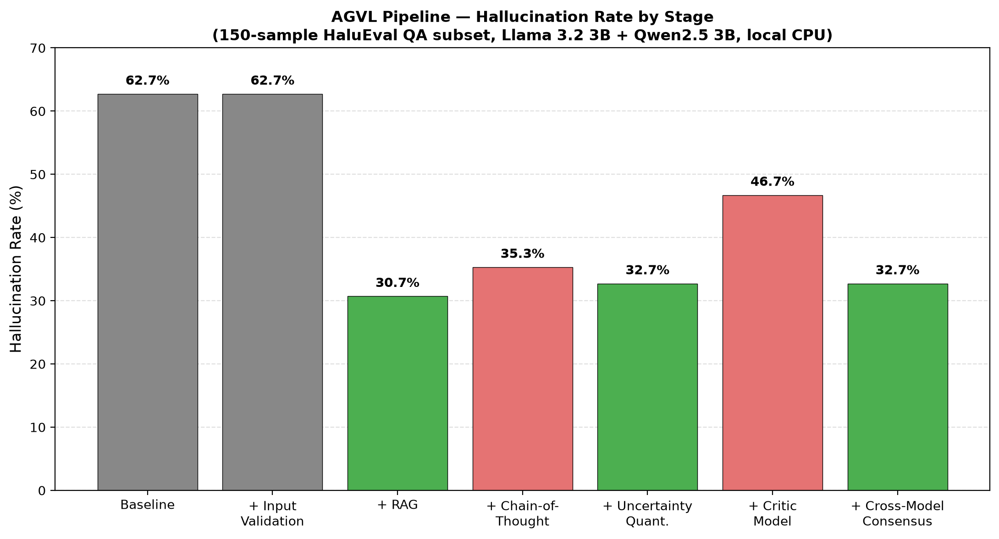

# AGVL — Empirical Validation

An 8-stage AI hallucination-reduction pipeline (AI Governance and Verification Layer), implemented and empirically tested end-to-end on local, free, CPU-only hardware.

## Overview

This project validates AGVL's design against a real benchmark rather than a projected figure. All 8 stages are implemented; 6 produce a measurable hallucination-rate change, and 2 (Human-in-the-Loop Gate, Production Monitoring) are operational/infrastructure stages demonstrated separately, as detailed below.

**Setup:** Llama 3.2 3B (generator) + Qwen2.5 3B (critic/judge/second model), both quantized (Q4_K_M), served locally via Ollama on a CPU-only, 8GB RAM laptop — no cloud APIs, no GPU.

**Benchmark:** 150-sample subset of HaluEval's QA dataset, gold-answer-graded by an LLM-judge with deterministic (temperature=0) scoring.

## Results



| Stage | Hallucination Rate | Change | Notes |
|---|---|---|---|
| Baseline (no pipeline) | 62.7% | — | |
| + Input Validation | 62.7% | 0 | No-op, expected — HaluEval is pre-cleaned |
| + RAG | **30.7%** | −32.0 pts | Largest single improvement |
| + Chain-of-Thought | 35.3% | +4.6 pts | Regression — see Findings below |
| + Uncertainty Quantification | 32.7% overall | +2.0 pts | See confidence-split finding below |
| + Critic Model | 46.7% | +16.0 pts | Regression — excluded from downstream stages |
| + Cross-Model Consensus | 32.7% (unchanged) | 0 | Adds a disagreement signal, doesn't change the answer |
| + Human-in-the-Loop Gate | — | — | 54.7% of questions correctly routed to review |
| + Production Monitoring | — | — | SQLite + Streamlit dashboard, logs all runs |

## Key findings

- **RAG is the single most effective stage**, cutting hallucination roughly in half.
- **Chain-of-Thought regressed results at this model scale.** Manual audit showed the model's reasoning sometimes led itself astray, or contradicted its own final answer. A follow-up prompt fix (explicitly requiring answer/reasoning consistency) made results *worse* (44.0%), not better — a genuine negative result, kept for transparency.
- **A same-capacity critic model is an unreliable corrector.** Qwen2.5 3B reviewing Llama 3.2 3B's answers revised 98/150 responses, and the revised group had a *worse* hallucination rate (61.2%) than the ones it left alone (19.2%). This suggests critic/verification stages need a stronger model than the generator to add value — a same-capacity peer review is actively harmful here.
- **Uncertainty signals are highly predictive, even when they don't move the headline number.** Both self-consistency (HIGH 19.8% vs LOW 55.6%) and cross-model consensus (AGREE 18.3% vs DISAGREE 56.1%) strongly separate correct from hallucinated answers. Combining both signals (flag if either fires) gives a 4.2x separation (50.0% flagged vs 11.8% unflagged) — this became the validated routing rule for the Human-in-the-Loop stage.

## Limitations

- **Sample size:** 150 questions from HaluEval's QA subset — sufficient for a directional signal, not a large-scale statistical claim.
- **LLM-as-judge scoring:** verdicts were spot-audited (15-20 rows per stage) but not independently human-labeled at full scale.
- **Model scale:** both models are 3B parameters, chosen for CPU feasibility. Results (especially the CoT and Critic regressions) may not generalize to larger models.
- **Minor run-to-run variance (~2 pts) observed even at temperature=0**, likely floating-point non-determinism in CPU inference.
- **Human-in-the-Loop and Production Monitoring stages are demonstrated, not measured** — no real human reviewer or live production traffic was involved; their metrics (review-routing rate, dashboard functionality) are reported separately from the hallucination-rate table above.

## Project structure
pipeline/ — core reusable modules (RAG retrieval, input validation, monitoring)
eval/ — per-stage evaluation scripts and analysis scripts
data/ — HaluEval subset used for testing
results/ — all stage outputs, scored CSVs, and the ablation chart
dashboard.py — Streamlit production-monitoring dashboard
## Running it yourself

```bash
pip install -r requirements.txt
ollama pull llama3.2:3b
ollama pull qwen2.5:3b
python download_data.py
python prepare_subset.py
python eval/baseline_eval.py
python eval/score_any.py baseline_results.csv "BASELINE"
# ...repeat per stage, see eval/ for each stage's script
```

## Relation to AGVL

This repo empirically validates the 8-stage pipeline design from the main AGVL project: **[github.com/mdraj-hunter/AGVL](https://github.com/mdraj-hunter/AGVL)**

It tests AGVL's core hypothesis (staged verification reduces hallucination) on real local models and a real benchmark, replacing the original projected figure with a measured one — while surfacing real constraints (not every stage helps at every model scale).